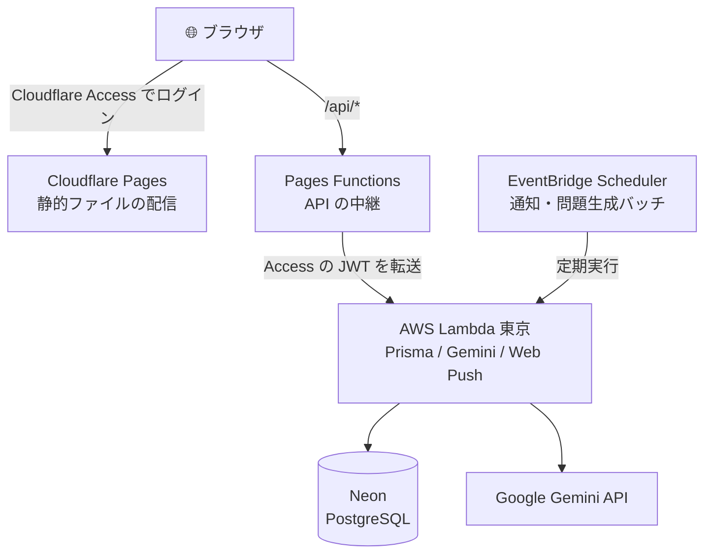
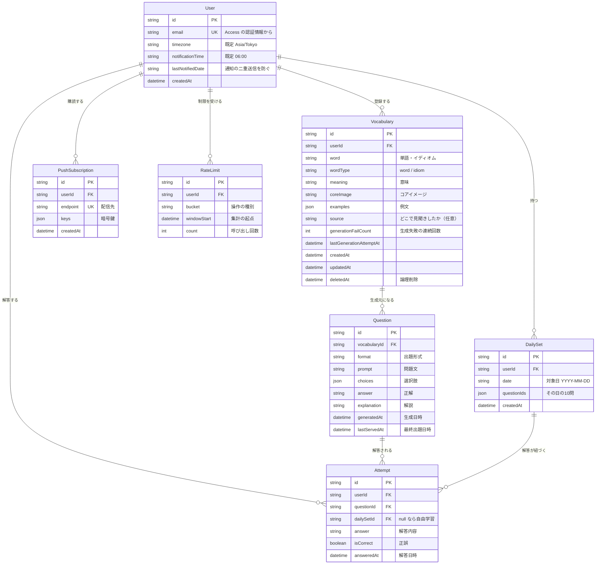

# English Study App

英単語・イディオムを登録すると、AI が問題を自動生成してくれる学習アプリ。毎日10問の復習を通知でリマインドし、覚えた単語を定着させる。

## 特徴

### 📖 コアイメージで覚える単語帳

単語・イディオムに加えて、意味、**コアイメージ**、例文を登録できる。丸暗記ではなく、その語が持つ感覚ごと記憶に残す。

「どこで見聞きしたか」も任意で残せる。映画、YouTube、ラジオ、洋書 — 出会った場面ごと覚えておくと、思い出すときの手がかりになる。

### 🤖 AI による問題の自動生成

Google Gemini が、登録した単語から問題・選択肢・解説を生成する。自分で問題を作る必要はない。

問題は夜間にバックグラウンドで少しずつ作り足され、**一度出た問題はしばらく再出題されない**。待たされることなく、毎回新しい角度から出題される。

### 🔁 毎日10問の復習

その日の10問は「まだ出していない」「間違えた」「まだ定着していない」単語を優先して選ばれる。**一度決まったセットはその日の間は変わらない**ので、途中でやめても続きから再開できる。

### 🔔 毎朝のリマインド通知

毎日 06:00（日本時間）に Web Push で通知が届く。通知をタップすればそのまま復習画面へ。通知時刻は毎正時から、タイムゾーンとあわせて設定で変更できる。

## 技術構成

| 領域 | 採用技術 |
| --- | --- |
| フロントエンド | Next.js 16（App Router、静的書き出し）+ React 19 + TypeScript |
| スタイリング | Tailwind CSS v4 |
| 配信 | Cloudflare Pages |
| API | AWS Lambda（東京リージョン、AWS SAM で管理） |
| データベース | Neon (PostgreSQL) + Prisma（pooled 接続） |
| AI | Google Gemini API |
| 認証 | Cloudflare Access |
| 通知 | Web Push + Amazon EventBridge Scheduler |

### 構成図



画面はブラウザ側で組み立て、データ処理はすべて Lambda で行う。Gemini API を呼ぶのは東京リージョンの Lambda のみで、API キーがブラウザに渡ることはない。

すべて各サービスの無料枠で運用できる構成になっている。

## データ構造



単語（`Vocabulary`）から問題（`Question`）が生成され、解答するたびに履歴（`Attempt`）が残る。この履歴をもとに「まだ定着していない問題」を選び、その日の10問（`DailySet`）を組み立てる。

`Vocabulary` は論理削除（`deletedAt`）にしている。物理削除すると、そこから生成された問題と学習履歴まで失われるため。

## 必要なもの

- Node.js 22.12 以上
- [Google Gemini API キー](https://aistudio.google.com/apikey)
- [Neon](https://neon.tech) アカウント（PostgreSQL）
- Cloudflare アカウント（Pages / Access）
- AWS アカウント（Lambda）と [AWS SAM CLI](https://docs.aws.amazon.com/serverless-application-model/latest/developerguide/install-sam-cli.html)

## セットアップ

```bash
git clone https://github.com/<your-account>/English-study-app.git
cd English-study-app
npm install
cd lambda && npm install && cd ..
```

### 環境変数

フロントエンドと Lambda で分かれている。

```bash
cp .env.example .env.local           # フロントエンド
cp lambda/.env.example lambda/.env   # Lambda
```

**フロントエンド（`.env.local`）** — ブラウザに埋め込まれる。秘密情報を置かないこと。

| 変数 | 説明 |
| --- | --- |
| `NEXT_PUBLIC_VAPID_PUBLIC_KEY` | Web Push の公開鍵 |

API は相対パス `/api` を叩くため、ベース URL の設定は不要。

**Lambda（`lambda/.env`）** — サーバー側にのみ置かれる。

| 変数 | 説明 |
| --- | --- |
| `DATABASE_URL` | Neon の **pooled** 接続文字列（`...-pooler.<region>.aws.neon.tech`） |
| `DATABASE_URL_TEST` | E2E 用（Neon のブランチ） |
| `GEMINI_API_KEY` | Gemini API キー |
| `VAPID_PRIVATE_KEY` | Web Push の秘密鍵 |
| `INTERNAL_API_KEY` | Pages Functions ↔ Lambda 間の共有シークレット |
| `CF_ACCESS_TEAM_DOMAIN` | Cloudflare Access のチームドメイン |
| `CF_ACCESS_AUD` | Access アプリケーションの Audience タグ |

**Cloudflare Pages の環境変数** — 管理画面で設定する。

| 変数 | 説明 |
| --- | --- |
| `LAMBDA_FUNCTION_URL` | 中継先の Lambda Function URL |
| `INTERNAL_API_KEY` | Lambda と同じ値 |

共有シークレットは `openssl rand -hex 32` で生成する。

Web Push の鍵は以下で生成できる。

```bash
npx web-push generate-vapid-keys
```

### データベースの準備

```bash
cd lambda
npx prisma migrate deploy
npm run db:seed
```

### 起動

```bash
cd lambda && npm run local    # API（別ターミナル）
npm run build                 # out/ を生成
npx wrangler pages dev out/   # フロント + Pages Functions
```

http://localhost:8788 を開く。

`next dev` ではなく `wrangler pages dev` を使うのは、`/api/*` を中継する Pages Functions をローカルでも動かし、**本番と同じ経路**で確認するため。

## デプロイ

### API（AWS Lambda）

```bash
cd lambda
npx prisma generate    # sam build は自動実行しない
sam build
sam deploy
```

初回は `sam deploy --guided` で設定を作成する。**リージョンは `ap-northeast-1`（東京）を選ぶこと** — Gemini API は呼び出し元のリージョンで制限されるため。

### フロントエンド（Cloudflare Pages）

**Pages の Git 連携でビルドさせる。** `NEXT_PUBLIC_*` は `next build` 時に静的展開されるため、手元でビルドして `out/` をアップロードすると Pages 側の環境変数が反映されない。

### アクセス制御

Cloudflare Zero Trust の管理画面で、Pages のドメインに Access ポリシーを設定する。無料枠は50ユーザーまで。これによりログイン機能を自前で実装せずに済む。

## 注意

- iOS で通知を受け取るには、Safari の共有メニューから**ホーム画面に追加**する必要がある。ブラウザのタブのままでは通知が届かない。
- Gemini API の無料枠には上限がある。問題は夜間バッチで少しずつ生成し、保存・再利用されるため通常の利用で超えることはない。
- Neon の無料枠はアイドル時に自動停止する。しばらく使っていないと最初のアクセスに数百ミリ秒かかる。

## ライセンス

MIT
